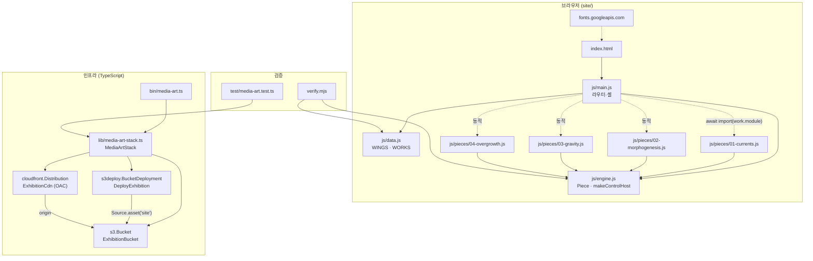
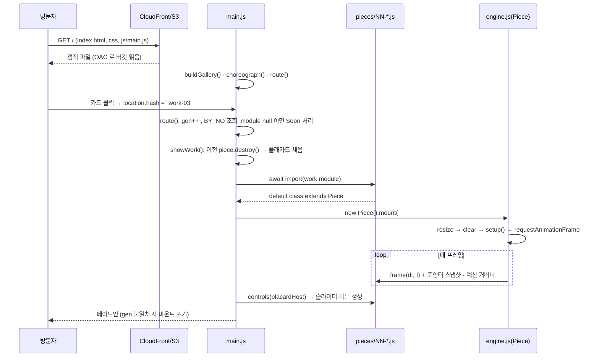

# media-art (Generative Hours) 아키텍처

## 1. 개요
- 한 줄 요약: 의존성 없는 Canvas 2D 제너러티브 아트 전시 사이트(`site/`)와, 그 디렉터리를 빌드 없이 S3 + CloudFront(OAC)로 올리는 CDK 스택(`lib/`)이 한 저장소에 있다.
- 스택: 브라우저 측은 순수 ES 모듈 + Canvas 2D(프레임워크·런타임 의존성 0), 인프라 측은 TypeScript + aws-cdk-lib 2.x / Jest(swc), 검증은 Node ESM 스크립트.
- 진입점: 브라우저는 `site/index.html` → `site/js/main.js`(`<script type="module">`). 인프라는 `cdk.json` 의 `app`(`npx tsc && npx tsx bin/media-art.ts`). 검증은 `node verify.mjs`, `npm test`.

## 2. 구성 요소
| 경로 | 역할 | 의존 대상 |
|---|---|---|
| `site/js/main.js` | 라우터·셸. 해시 라우팅, 갤러리 빌드, 작품 동적 import/마운트, 캡션·자동 관람·호버 프리뷰, `window.__gh` 디버그 훅 | `data.js`, `engine.js`, 작품 모듈(동적) |
| `site/js/engine.js` | `Piece` 기반 클래스(마운트/파괴 생명주기, dt 캡, 포인터 스냅샷, DPR 백킹스토어, 프레임 예산 거버너)와 `makeControlHost` | 없음 |
| `site/js/data.js` | 전시 카탈로그(`WINGS`, `WORKS`). 로직 없는 순수 데이터 | 없음 |
| `site/js/pieces/01..04*.js` | 작품 구현. `Piece` 를 상속한 클래스를 default export | `engine.js` |
| `site/css/style.css`, `site/index.html` | 뷰 상태(`body[data-view]`)로 전환되는 아트리움/갤러리/전시실 3화면 셸 | — |
| `lib/media-art-stack.ts` | `MediaArtStack`: S3 버킷 + CloudFront 배포 + `BucketDeployment` + CfnOutput 3개 | aws-cdk-lib(s3, s3-deployment, cloudfront, cloudfront-origins) |
| `bin/media-art.ts` | CDK App 진입점. `MediaArtStack` 1개를 env-agnostic 으로 인스턴스화 | `lib/media-art-stack.ts` |
| `verify.mjs` | 카탈로그·작품 계약 검사. `no` 중복/`wing` 유효성, 작품이 `Piece` 상속·`setup`/`frame` 구현·`destroy` 미재정의, 모듈 스코프 DOM 접근 금지를 정적 스캔 | `site/js/data.js`, `site/js/engine.js`, 작품 모듈 |
| `test/media-art.test.ts` | `Template`/`Match` 로 합성 템플릿 단정(퍼블릭 차단, OAC, 업로드, 출력) | `lib/media-art-stack.ts` |

## 3. 구조 도면

## 4. 핵심 흐름

## 5. 데이터와 외부 의존
- 저장소: 상태를 담는 DB·큐·캐시가 없다. 지속 스토리지는 사이트 파일이 올라가는 S3 버킷 하나뿐이며(퍼블릭 접근 전면 차단, SSE-S3, `enforceSSL`) CloudFront 만 OAC 로 읽는다.
- 클라이언트 상태: URL 해시(`#`, `#gallery`, `#work-<no>`)가 라우팅의 단일 출처. `sessionStorage` 키 `gh:entered`(입장 연출 1회 제한)가 유일한 브라우저 저장.
- 외부 서비스: Google Fonts(`fonts.googleapis.com`, `fonts.gstatic.com`) 스타일시트 1건. 그 외 네트워크 호출·API·인증 공급자·시크릿 없음.
- 환경변수: 런타임에 읽는 값 없음. 스택은 env-agnostic(`bin/media-art.ts` 의 `env` 는 주석 처리)이라 계정·리전은 CDK CLI 자격증명에서 온다.
- 배포 특성: `distributionPaths: ['/*']` 로 배포마다 전체 무효화, `defaultRootObject: index.html`, SPA fallback(`errorResponses`) 없음.

## 6. 확인 필요
- CI 워크플로가 없어 `npm test` / `node verify.mjs` / `cdk deploy` 를 무엇이 언제 실행하는지는 저장소만으로 확정할 수 없다.
- `site/package.json` 은 `{"type":"module"}` 뿐이며 사이트 측 빌드·번들 단계는 없다(의도된 설계로 주석에 명시).
